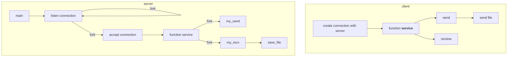

# Computer-Network

## Ver 1

```shell
# run
make
./server 5005
./client localhost 5005
```

## Ver 2

```shell
# run
make
./server 5005
# to test multiple connections, run this script in many terminals:
./client localhost 5005
```

## Ver 3

multiple processes

## Ver 4

big file transport, breakpoint check


